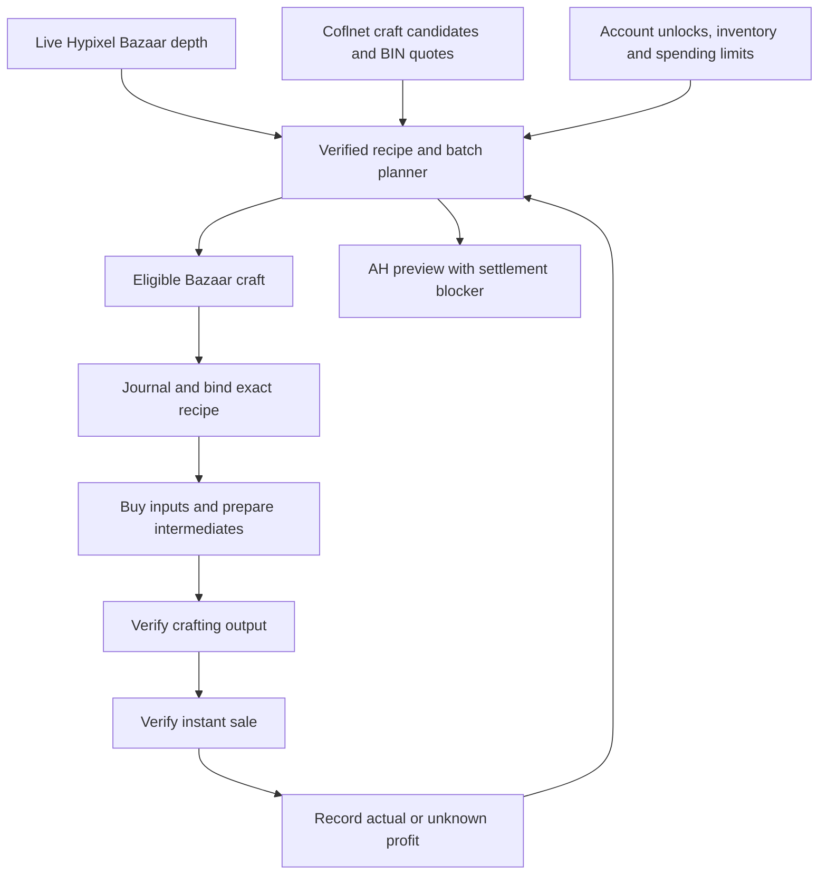

# Craft flip discovery and execution — 0.2.27

## Shipped behavior

Select **CRAFT** in G → Macros → Mode and start with the existing trading toggle.
This mode selects one eligible Bazaar craft, buys its missing base materials,
prepares reviewed basic intermediates, crafts the exact ranked recipe, and
instant-sells verified output. It then recomputes the next route from live data.
Books/general order engines do not start in this mode. Existing lifecycle,
account/profile binding, stop, recovery and menu ownership rules still apply.

The craft plan is available while stopped too: local dashboard → **Craft production
plan**, or `.a* goofyaddon production flips`. GUI settings control sale market,
maximum batch capital (zero uses spendable capital), minimum net profit and batch
limit (1–16). AH-only selection currently produces previews and no automatic buys.



## Sources and contracts

- Bazaar inputs/output prices come from the normal public Hypixel Bazaar API,
  refreshed through the existing collector/Bazaar API adapter. Quotes over 60
  seconds old are unusable.
- Coflnet supplies AH craft candidates through `/api/crafts/profit`; public
  SkyCrafts controller path `/crafts/profit` and `ProfitableCraft` fields are
  documented in [Coflnet/SkyCrafts](https://github.com/Coflnet/SkyCrafts/tree/1d25352d31cfa94f04a797bd7c120e4d0bc3b565).
  Coflnet's [official crafting command](https://github.com/Coflnet/SkyModCommands/blob/8f8e8e95db043b87ac0e0fb53a4085511c4e3b87/Commands/State/CraftsCommand.cs)
  calls `GetProfitableAsync`. Rows must identify a crafting route, contain positive
  cost/price/volume/median values, and be updated within five minutes.
- The local endpoint `/v1/crafts/market` returns `goofy-craft-market/1`, sanitized
  candidates and separately refreshed `goofy-ah-price/1` lowest BIN quotes. No
  auction UUID is returned or used for navigation. Bazaar output IDs are excluded
  from AH discovery when the companion has a fresh Bazaar snapshot.
- Discovery refreshes at most once a minute; bounded quote rotation runs at most
  every 20 seconds. Four leading candidates plus four rotating candidates are
  considered per update. Quotes expire after 60 seconds. Discovery failures do
  not prevent Bazaar ranking and never supply invented prices.
- Use the existing private `COFLNET_TOKEN` environment variable or
  `coflnet-token.txt` in the companion data directory if the API needs access.
  Credentials remain private and are sent only to Coflnet.

External candidates must match the mod's bundled, validated NEU-derived crafting
grids. Unknown recipes are never converted into guessed clicks. Forge, Kat, NPC
shop and non-crafting rows cannot enter this automatic craft loop.

## Feasibility and ranking

Each candidate evaluates whole batches, not arbitrary scaled top prices:

1. Expand reviewed basic intermediates (rods → powder, logs → planks → sticks,
   etc.) using the same preparation planner as execution. An input without fresh
   Bazaar depth is unsupported for automatic procurement.
2. Walk the full ask-side input depth; include the existing observed 4% instant-buy
   surcharge and a 3% total procurement allowance.
3. Walk bid-side output depth for the entire Bazaar batch; subtract configured
   tax and a 3% sale-price movement allowance. AH previews use a fresh validated
   lowest BIN, the conservative listing fee ceiling, a 10% GUI-price allowance
   and a 3.5% claim-tax allowance. These are estimates, not paid receipts.
4. Fit the batch inside spendable funds, configured batch capital, empty inventory
   space, grid/output/intermediate capacity and the 1–16 batch executor limit.
5. Require observed collection/skill/slayer unlocks. Skip conflicting positions,
   held outputs and unreadable Personal Compactor configurations. Known compactor
   recipes are cleared by the production preflight before inputs are bought.
6. Limit a Bazaar batch to 5% of daily volume estimated from the smaller weekly
   buy/sell counter. Rank using conservative net profit, estimated GUI work and
   liquidity. Coflnet's reported volume affects AH confidence without assuming
   its unspecified time window is daily volume.

The ranking score is an ordering aid, **not realized coins/hour**. Craft timings
are estimates; order-flip gameplay corrections are not applied to craft routes.
A shared per-craft timing/profit learning contract remains future work.

Before queueing, the mod recomputes eligibility from current inventory and budget.
The production run binds the selected recipe key through final crafting. Before
further purchases, fresh output depth must still clear the minimum-profit target.
The run's aggregate spending envelope shrinks by receipt-confirmed purchases.
Completed output is sold at the then-current verified quote; sale is not blocked
by the original profit target after crafting.

## Receipts and profit

A completed output and an instant sale produce idempotent `craft` profit-ledger
events. Cost is receipt-confirmed input spending. Using previously held inputs
makes cost basis unknown; the ledger counts that settlement as incomplete rather
than treating old materials as free. All bought material costs are conservatively
charged to this run, including any preparation surplus; surplus cost lots are
not yet allocated across later craft runs.

A production instant sale requires the expected items to disappear and a purse
increase within the quoted range. An unrelated large purse change is uncertain
and cannot create confirmed profit. Publication of an AH listing never counts as
a completed sale. Saved interrupted transactions continue to require review.

## Remaining AH pipeline work

AH crafts appear in the plan with an explicit settlement blocker. The existing
`.a* goofyaddon production test ITEM_ID` can individually buy supported Bazaar
components, craft, validate normal /ah GUI prices against Coflnet, and publish
one verified BIN listing. This does not implement AH-component procurement or
sale/expiry/claim reconciliation. Multi-output AH batches remain unsupported.

Before enabling automatic AH loops, implement tracked listing capacity/capital,
exact seller-listing reconciliation, sold/expired state handling, claim receipts,
actual listing/claim fees and recovery after reconnect. Arbitrary attributes,
reforges and pet variants also need their own pricing/identity contracts.

## Validation limits

Automated Java/Node tests and a Chromium dashboard check cover planning, source
validation, fee/depth/capacity gates, menu composition, recipe pinning, receipts,
redaction and stale-data behavior. Live Minecraft execution and the deployed
Coflnet gateway still need real-session validation; direct gateway access from
this development environment returned HTTP 403. The controller/model contract
was verified from Coflnet's public source instead.

## Stacked crafting (0.2.28)

The executor now loads ingredients for several recipe uses before collecting the
output. Each grid cell is bounded by its ingredient's observed stack limit,
available ingredients, remaining requested batches and conservative output space.
Known basic stackable outputs reserve space at 64 units per slot; unknown outputs
reserve one slot per unit. Large recipes are split into chunks that fit the grid.
Intermediate preparation child jobs now accept up to 64 recipe uses instead of 16.
The existing final-production investment and batch limits remain unchanged.

For 64 blaze rods, the grid is filled once and the 128 powder is checked against
64 consumed rods. If the server's shift click produces just one recipe use, the
remaining ingredients stay loaded and the executor collects subsequent outputs.
No refill occurs between those partial collections. Progress advances only after
exact ingredient/output conservation and an empty grid/cursor are verified; the
journal saves the verified chunk's actual completed recipe uses in one write.

Normal acknowledged actions settle for 50 ms (one game tick) rather than 100 ms.
Slowdown messages increase this delay and impose the existing one-second cooldown.
Unchanged/rejected inputs retain bounded retries; unexplained inventory changes
pause execution with owned items retained. This does not batch unacknowledged
clicks or assume shift-click output succeeded. Live server behavior still needs
validation with the downloadable mod.

`.a* goofyaddon craft OUTPUT_ID 64` can queue up to 64 uses from held ingredients;
start it with the usual trading toggle. Smaller requested quantities stay exact.

## Account lookup and cold startup (0.2.29)

Craft prerequisites no longer depend on the localhost calculator being available.
The mod calls the same fixed HTTPS `/v1/profiles?username=...` service as the public
website, using the normal Java HTTP proxy policy rather than the loopback-only
client. It needs no player API key or contributor key. Account/profile identity,
live-skill agreement, unknown collection handling and the five-minute freshness
limit remain enforced before spending. An unavailable service, a missing unlock,
wrong profile or expired response still blocks purchases. Service failures retain
bounded backoff and clear error codes; diagnostics identify `PUBLIC_WEBSITE` as
the source. No account profile is uploaded to the shared gameplay dataset.

This separates progression verification from the calculator's market/feed/upload
process. Automatic market selection, the local dashboard and shared learning still
need that process. The calculator now registers its bundled website allowlist but
reads each static file only on first request, rather than reading more than 5,000
files before opening its port. The supervisor allows up to 45 seconds for cold
startup, off the game thread, while still noticing an immediate Node exit. It
continues to preserve pairing keys, saved history and existing configuration.

The screenshot's `Local calculator connection failed` proves the old prerequisite
request could not reach the local server; it does not identify the Node process's
original startup error. If the dashboard/feed still waits after this update,
export F7 diagnostics. Its supervisor state, last exit code and redacted
`companion-error.log` tail are needed to identify that separate runtime failure.
No public website redeployment is necessary for this mod-side account fix.
The shared-learning Sync status now includes the supervisor's reason when the
calculator is unavailable (auto-start off, port conflict, preparing or failed),
rather than displaying an indefinite generic wait with no explanation.

## Reusing the crafting GUI (0.2.30)

Ingredient preparation and final crafting in a craft production run now reuse the
same clean Craft Item menu. Child jobs leave it open only after the executor
verifies the outputs and an empty grid/cursor. The parent retains menu ownership
between child jobs, then hands it directly to the next crafter; ordinary traders
cannot take that GUI during the handoff. Metadata-only handoffs use 50 ms pacing
instead of the normal trading action delay. Recipe and journal checks still run
for every child job, including a reused menu.

A standalone craft closes its menu on completion as before. A production run
closes its retained menu when it finishes without a sale, or when it needs to
switch to Auction House listing. Bazaar navigation replaces it with the required
product menu. Forge/Kat preparation keeps the former standalone-close behavior.
No occupied cursor or unfinished grid is adopted for the next recipe.

## Clearing compactor filters before production (0.2.31)

Every craft and Forge production run clears all recipes from every detected
Personal Compactor before procurement. Standalone crafting uses the same gate.
This includes unrelated filters and disabled compactors; the ON/OFF setting is
preserved. Existing filters are intentionally not restored, per the user's
request to start with an empty configuration. These are filter entries, not
inventory stacks: clearing them does not sell, drop, or delete materials.

The two supplied 7000 menu captures verify all twelve numbered controls, their
product IDs, removal lore, empty-filter lore and the activation toggle. Sanitized
fixtures retain only menu fields, without account or session details. Each
removal intent is saved in the production journal before its click. The executor
waits for the exact expected filter map, checks that inventory counts did not
change, and finally closes the menu and verifies empty saved item metadata. A
missing acknowledgement, replaced container, unexpected recipe change or changed
inventory stops the run for review; removal clicks are not blindly replayed.

Automatic opening uses an owned hotbar compactor. Put each compactor in the
hotbar for automatic clearing, or manually open an inventory compactor's menu.
Unreachable or unreadable detected devices block production rather than being
skipped. Only devices observed in inventory or the current Accessory Bag page
can be checked; this does not inspect unseen bag pages. Book/general trading
and Kat pet upgrades do not enter this crafting preflight. Automatic bulk
compaction remains disabled; this release adds the required initial cleanup.

## Craft mode and one-item AH tests (0.2.32)

The saved `CRAFT` mode is now labelled **Craft flips** in the settings mode
selector, with a **Use craft mode** shortcut on its card. Apply the settings and
use Start for automatic Bazaar craft selection. AH recommendations remain
individual tests until sale/expiry/claim reconciliation is implemented.

With trading stopped, use:

```text
.a* goofyaddon production testah ASPECT_OF_THE_END
```

Alternatively enter a product ID in **AH test item**, then click **Run one test**
on the Craft flips settings card. Apply or discard pending settings first. The
test buys missing inputs within spending limits, clears detected compactor
filters, checks account prerequisites, crafts one item and publishes one BIN.
It runs independently of the trading mode and rest schedule. Stop/toggle ends
it. It never treats publication as a confirmed sale or profit.

Aspect of the End requires Ender Pearl VIII and uses 32 Enchanted Eyes of Ender
and one Enchanted Diamond: 16 eyes in each of the two sword blade cells, with the
diamond as its handle. An AH test accepts only a verified recipe yielding one
item per batch. Move any matching output already held before testing another
craft; existing seller listings do not themselves prevent a new test.

`testah` always chooses the Auction House. With no price supplied, Coflnet provides
a price-only reference, refreshed again after crafting before the listing is
priced one coin below the fresh lowest BIN. Selling navigates `/ah` directly to
Create Auction or Manage Auctions, without opening the Auctions Browser. The
explicit-price form is `production testah <productId> <price>`; it still passes
the GUI and Coflnet validity checks. The original `production test` keeps
its automatic Bazaar/AH choice. Unknown recipes are rejected before price lookup.

Four sanitized live AH captures now cover **Co-op Auction House**, the empty
**Create BIN Auction** form, the compact **Confirm BIN Auction** button and the
resulting **BIN Auction View**. Navigation accepts solo and co-op home titles.
The compact confirmation contains a Selling name and listing fee, without an
item stack or sale price: it is accepted only after this executor verified the
exact identity, price and duration in the creation form, clicked Create once,
observed a different container, and verified unchanged player inventory. It must
show the matching Selling name and exact bounded fee. A generic confirmation,
wrong name, conflicting price or changed inventory cannot publish.

Publication can finish at the observed own **BIN Auction View**, as well as
Manage Auctions. Both still require the exact item identity and price, no item
left in inventory and the exact fee debit. The view must explicitly say it is
the player's own auction. No buy/cancel controls are clicked to prove receipt.

## Direct auction selling and sign-editor transitions (0.2.33)

The latest diagnostic shows AOTE crafting completed, then selling entered the
Auctions Browser for a market-price check and paused as its search sign opened.
Sales now fetch only a fresh Coflnet price, validate item ID, age, outlier and
price bounds, and start BinListingExecutor directly. At Co-op Auction House this
clicks the observed Create Auction control, rather than Auctions Browser. The
existing creation-form identity/price, fee ceiling, confirmation, own-listing
and receipt checks remain required. No API auction IDs are used. Pausing or
finishing clears the queued price-check/item state.

BIN purchases still use normal browser navigation. Expected search and price
signs are write-only steps, so their handler runs before checking the underlying
container cursor. Hypixel's sign transition can temporarily expose a carried
control; after return, the empty-cursor and exact-item checks apply again before
any item movement, selection or publication. Each expected sign is written once.
An unexpected sign or a cursor still occupied after return blocks the operation.
The regression uses the supplied browser's actual Search (48), Sort (50) and
BIN Filter (52) controls; the fixture excludes auction items and seller details.


## Navigation lag recovery (0.2.34)

Auction browsing and BIN creation wait up to 15 seconds for missing controls,
search results, confirmation controls and transient cursor state. Deadlines are
tracked by missing evidence, so polling cannot restart them indefinitely. No
placeholder is clicked. Ambiguous creation buttons, wrong items, changed prices
and excessive fees still block; a permanently missing control ends with a
specific failure and no guessed transaction.

The production Bazaar buyer now uses NavigationRetry for Buy Instantly (opening
the amount screen) and Custom Amount (opening the sign). An unchanged, verified
control must remain stable for 750 ms; retries start after 3 seconds and stop
after three retries or 15 seconds. Changed screens and sign editors acknowledge
navigation. These retries precede purchase intent and never replay a preset buy,
amount submission or purchase confirmation. Bazaar search already reopens after
an unacknowledged product selection; the crafting executor already retries
verified grid inputs with conservation checks and adaptive pacing.

Item transfer, auction creation and final publication remain single submissions.
Uncertain transactions require reconciliation rather than blind replay. This
release improves recoverable menu lag; it does not automatically resume a run
whose inventory or coin evidence cannot establish what happened.

## Full craft catalog coverage (0.2.35)

The catalog increases from 2,259 to 2,529 craft rows, adding 270 rows. The importer
uses NEU revision `c4f7d4757641f3a11c74d3d77cec76c100abaf98` and accounts for all
2,561 distinct source grids, including top-level grids on items also offering
NPC trades. Of those, 2,528 are validated and imported; one prior duplicate key
is preserved for saved jobs. All prior crafting keys remain available.

Legacy item variants now use Hypixel's colon IDs, and recognized enchantment
books use `ENCHANTMENT_NAME_LEVEL` IDs. Counts, nine-cell totals, yields and
collection/skill/slayer/reputation gates remain validated. New recipes include
bait sacks, Hotspot accessories, colored/wood variants and enchanted books.

The 33 remaining source grids are recorded with exact source grids and reasons:
32 pet/shard variants require exact identity and yield handling, and one
conversion consumes its own output ID. They are not enabled for automatic
crafting. The website shows this coverage and searchable exclusion list. The
reproducible importer and maintenance workflow are in `tools/recipes/README.md`.
Prices, component availability, unlocks and spending limits still filter routes;
this release does not add AH-component purchases or automatic AH settlement.

Use `.a* goofyaddon production recipes` for catalog totals, or
`.a* goofyaddon production recipes SMALL_BAIT_SACK` for a recipe's inputs/gates.
Quote IDs containing punctuation, for example
`.a* goofyaddon production recipes "WOOD:1"` or
`.a* goofyaddon production recipes "ZOMBIE;0"` (an excluded pet recipe).
The public website ZIP must be redeployed to update an existing Worker; installing
the new JAR updates its bundled local calculator automatically.

## HotM and Slayer prerequisites (0.2.36)

Profile imports supply Heart of the Mountain and Zombie, Spider, Wolf, Enderman,
Blaze and Vampire Slayer levels. Craft and workstation routes check their catalog
requirements before buying materials and again before submission. Missing, stale
or invalid account evidence keeps the route blocked with its unmet requirement.
When Hypixel publishes Slayer `claimed_levels`, usable tiers are limited to the
claimed rewards; profiles without that field retain the XP-based level.

Forge access requires HotM II. The configured slot must also be available at the
observed tier (up to seven slots), and each recipe can require a higher tier.
Actual confirmation controls are checked for additional HotM/Slayer requirements.
Already submitted jobs can still reconcile receipts and claim outputs if account
evidence expires. Catalog codes such as `WOLF_3` and `EMAN_6` now normalize to
readable Slayer requirements rather than blocking as unknown text.

Use `.a* goofyaddon production requirements` to inspect profile status, HotM and
all six Slayer levels. Install the new JAR for local execution checks. Redeploy
the 0.2.36 public website ZIP for the updated Worker profile import and website
Slayer summary; existing secrets and deployment configuration are retained.
