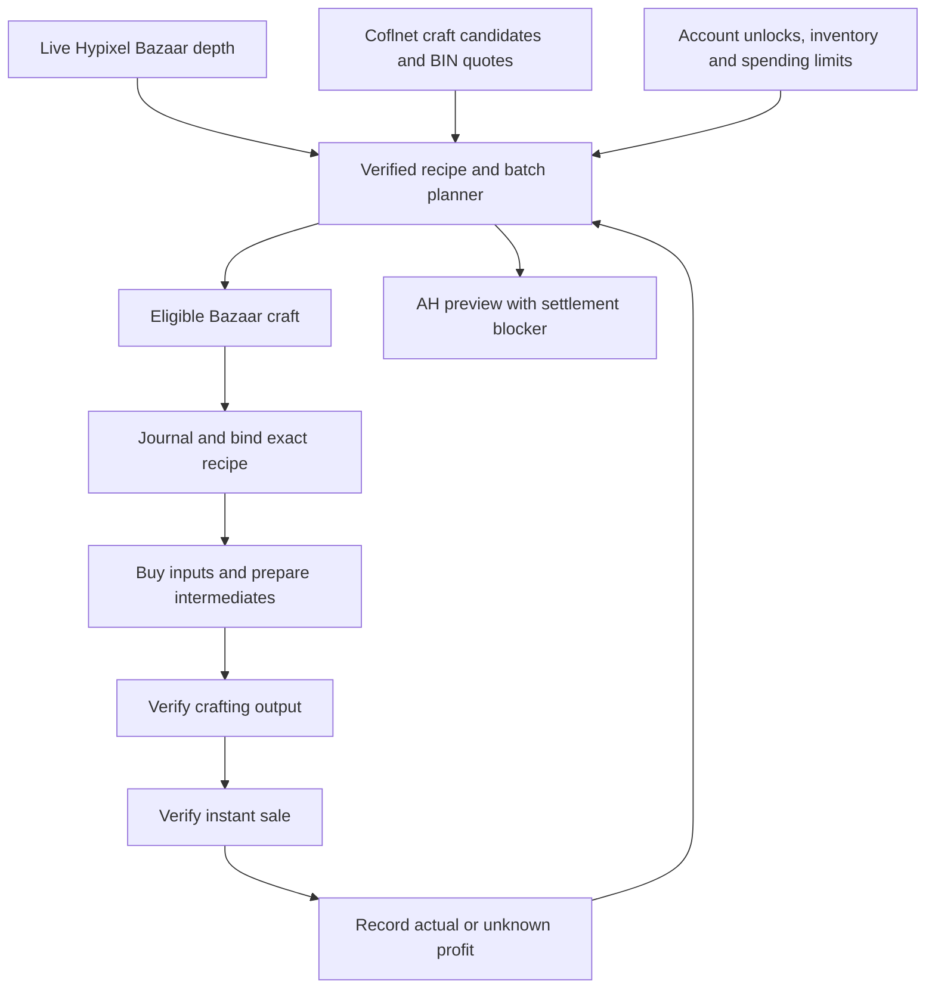

# Craft flip discovery and execution — 0.2.27

## Shipped behavior

Select **CRAFT** in G → Macros → Mode and start with the existing trading toggle.
This mode selects one eligible Bazaar craft, buys its missing base materials,
prepares reviewed basic intermediates, crafts the exact ranked recipe, and
instant-sells verified output. It then recomputes the next route from live data.
Books/general order engines do not start in this mode. Existing lifecycle,
account/profile binding, stop, recovery and menu ownership rules still apply.

The craft plan is available while stopped too: local dashboard → **Craft production
plan**, or `.a* goofyaddon production flips`. GUI settings control sale market,
maximum batch capital (zero uses spendable capital), minimum net profit and batch
limit (1–16). AH-only selection currently produces previews and no automatic buys.

## Sources and contracts

- Bazaar inputs/output prices come from the normal public Hypixel Bazaar API,
  refreshed through the existing collector/Bazaar API adapter. Quotes over 60
  seconds old are unusable.
- Coflnet supplies AH craft candidates through `/api/crafts/profit`; public
  SkyCrafts controller path `/crafts/profit` and `ProfitableCraft` fields are
  documented in [Coflnet/SkyCrafts](https://github.com/Coflnet/SkyCrafts/tree/1d25352d31cfa94f04a797bd7c120e4d0bc3b565).
  Coflnet's [official crafting command](https://github.com/Coflnet/SkyModCommands/blob/8f8e8e95db043b87ac0e0fb53a4085511c4e3b87/Commands/State/CraftsCommand.cs)
  calls `GetProfitableAsync`. Rows must identify a crafting route, contain positive
  cost/price/volume/median values, and be updated within five minutes.
- The local endpoint `/v1/crafts/market` returns `goofy-craft-market/1`, sanitized
  candidates and separately refreshed `goofy-ah-price/1` lowest BIN quotes. No
  auction UUID is returned or used for navigation. Bazaar output IDs are excluded
  from AH discovery when the companion has a fresh Bazaar snapshot.
- Discovery refreshes at most once a minute; bounded quote rotation runs at most
  every 20 seconds. Four leading candidates plus four rotating candidates are
  considered per update. Quotes expire after 60 seconds. Discovery failures do
  not prevent Bazaar ranking and never supply invented prices.
- Use the existing private `COFLNET_TOKEN` environment variable or
  `coflnet-token.txt` in the companion data directory if the API needs access.
  Credentials remain private and are sent only to Coflnet.

External candidates must match the mod's bundled, validated NEU-derived crafting
grids. Unknown recipes are never converted into guessed clicks. Forge, Kat, NPC
shop and non-crafting rows cannot enter this automatic craft loop.

## Feasibility and ranking

Each candidate evaluates whole batches, not arbitrary scaled top prices:

1. Expand reviewed basic intermediates (rods → powder, logs → planks → sticks,
   etc.) using the same preparation planner as execution. An input without fresh
   Bazaar depth is unsupported for automatic procurement.
2. Walk the full ask-side input depth; include the existing observed 4% instant-buy
   surcharge and a 3% total procurement allowance.
3. Walk bid-side output depth for the entire Bazaar batch; subtract configured
   tax and a 3% sale-price movement allowance. AH previews use a fresh validated
   lowest BIN, the conservative listing fee ceiling, a 10% GUI-price allowance
   and a 3.5% claim-tax allowance. These are estimates, not paid receipts.
4. Fit the batch inside spendable funds, configured batch capital, empty inventory
   space, grid/output/intermediate capacity and the 1–16 batch executor limit.
5. Require observed collection/skill/slayer unlocks. Skip conflicting positions,
   held outputs and active/unreadable Personal Compactor recipes.
6. Limit a Bazaar batch to 5% of daily volume estimated from the smaller weekly
   buy/sell counter. Rank using conservative net profit, estimated GUI work and
   liquidity. Coflnet's reported volume affects AH confidence without assuming
   its unspecified time window is daily volume.

The ranking score is an ordering aid, **not realized coins/hour**. Craft timings
are estimates; order-flip gameplay corrections are not applied to craft routes.
A shared per-craft timing/profit learning contract remains future work.

Before queueing, the mod recomputes eligibility from current inventory and budget.
The production run binds the selected recipe key through final crafting. Before
further purchases, fresh output depth must still clear the minimum-profit target.
The run's aggregate spending envelope shrinks by receipt-confirmed purchases.
Completed output is sold at the then-current verified quote; sale is not blocked
by the original profit target after crafting.

## Receipts and profit

A completed output and an instant sale produce idempotent `craft` profit-ledger
events. Cost is receipt-confirmed input spending. Using previously held inputs
makes cost basis unknown; the ledger counts that settlement as incomplete rather
than treating old materials as free. All bought material costs are conservatively
charged to this run, including any preparation surplus; surplus cost lots are
not yet allocated across later craft runs.

A production instant sale requires the expected items to disappear and a purse
increase within the quoted range. An unrelated large purse change is uncertain
and cannot create confirmed profit. Publication of an AH listing never counts as
a completed sale. Saved interrupted transactions continue to require review.

## Remaining AH pipeline work

AH crafts appear in the plan with an explicit settlement blocker. The existing
`.a* goofyaddon production test ITEM_ID` can individually buy supported Bazaar
components, craft, validate normal /ah GUI prices against Coflnet, and publish
one verified BIN listing. This does not implement AH-component procurement or
sale/expiry/claim reconciliation. Multi-output AH batches remain unsupported.

Before enabling automatic AH loops, implement tracked listing capacity/capital,
exact seller-listing reconciliation, sold/expired state handling, claim receipts,
actual listing/claim fees and recovery after reconnect. Arbitrary attributes,
reforges and pet variants also need their own pricing/identity contracts.

## Validation limits

Automated Java/Node tests and a Chromium dashboard check cover planning, source
validation, fee/depth/capacity gates, menu composition, recipe pinning, receipts,
redaction and stale-data behavior. Live Minecraft execution and the deployed
Coflnet gateway still need real-session validation; direct gateway access from
this development environment returned HTTP 403. The controller/model contract
was verified from Coflnet's public source instead.
