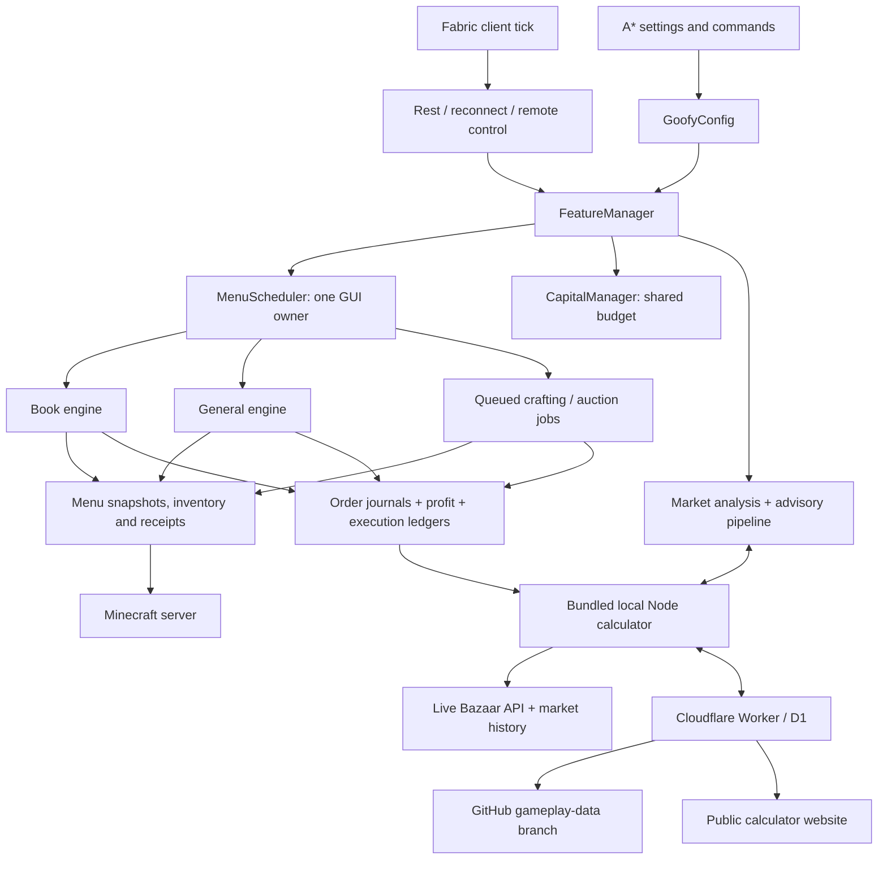
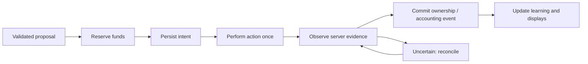

# GoofyAddons / A* architecture review

Review date: 2026-10-07. Snapshot: local `codex/goofyaddons-integration` worktree, based on `fbeb37d`, including the uncommitted changes used for client **0.2.14-BETA**. This describes this workspace; it does not establish which version is installed on your PC or deployed to Cloudflare.

**Feature work was paused for this review.** No runtime code was changed as part of the audit. The objective is to make ownership, unfinished work, and failure paths reviewable before adding more features.

The subsequent foundation extraction is documented in [trading-core](../trading-core/README.md); the findings below record the pre-refactor review.

## What needs attention first

The recurring bugs are concentrated at boundaries: clicking versus server confirmation, saving orders versus saving profit, editing settings versus restarting the calculator, and pausing a session versus recovering a transaction. There are useful safeguards already. A gradual cleanup should preserve them.

My recommended order is:

1. Make calculator startup and settings changes reliable and diagnosable.
2. Give start, stop, rest, reconnect, and recovery one coordinating owner.
3. Standardize transaction evidence and recovery across trading engines.
4. Make persisted ownership and accounting consistent and account/profile specific.
5. Align planning, predictions, and capability reporting; then expand production routes.

The calculator failure on your PC remains **unresolved**. The last uploaded error log is identical to the earlier log and only proves an address conflict on port **8789**. It does not explain the later failure after selecting **8790**. Architectural weaknesses below are evidence from the code, not a substitute for that missing diagnosis.

## Current component map

The public website and local calculator have overlapping functionality, but they are separate deployments with separate entry points. A working public site does not prove the local companion has started.

| Area | Current owner / entry point | Responsibility |
| --- | --- | --- |
| Pathfinder | A* `core`, `pathing`, `movement`, `mcworld`, client adapters | Path planning and movement; the existing [architecture document](ARCHITECTURE.md) covers this side |
| Settings UI | `client/.../AstarScreen.java` | Trading controls mixed into the A* screen |
| Client lifecycle | `GoofyAddonsClient`, `FeatureManager`, session classes, Discord control | Starts, ticks, pauses, stops and recovers features |
| GUI ownership | `MenuScheduler` | Rotates engines only when their transaction can yield |
| Funds | `CapitalManager` | Reservations, pending purchases, funded exposure and spendable balance |
| Execution | `BazaarFlipper`, `GeneralFlipper`, production executors | Navigation, actions, evidence checks, retries and reconciliation |
| Observations | `ServerMenuMirror`, `MenuSnapshot`, inventory helpers | Separates server updates from optimistic client actions |
| Recommendations | `ShadowMarketAnalysis`, `PipelinePlanner`, `AutomaticSelection` | Forecast validation, allocation preview, next-route selection |
| Local services | `ManagedCompanion`, Node `server.mjs` | Calculator process, dashboard, data collection, shared learning and Discord |
| Community service | `tools/gameplay-collector/worker.mjs` | Authorized uploads, D1 persistence, GitHub publication, public account/market endpoints |

## What actually executes today

| Capability | Current state | Boundary to keep visible |
| --- | --- | --- |
| Book flips | Integrated automatic engine | Buying, combining, selling, retirement and saved-position recovery |
| General Bazaar flips | Integrated automatic engine | Buying, selling, repricing, retirement and saved-position recovery |
| Automatic selection | Integrated for supported book/general routes | Rechecks mode, budget, capacity, requirements and fresh prices |
| Pipeline | Advisory allocation plus selection of its next route | It is not a durable queue reserving and executing the entire preview |
| Crafting | Queued recipe execution | Not a general automatic procurement-to-sale engine |
| Auction House | Queued BIN purchase/listing/management helpers | This is not proof that every recommended AH route is executable |
| Forge / Kat | Menu parsers, durable job model and submission/claim executor exist | `WorkstationExecutor` has no runtime caller outside its own implementation in the reviewed client source; the complete automatic loop is not wired |
| Production recommendations | Planning exists | `ProductionPlanner` marks candidates non-executable; Kat is skipped by that Bazaar-only planner |
| Adaptive estimates | Local execution history and shared-history calibration exist | Calibration affects estimates; it cannot guarantee an hourly return |

The UI should eventually use one capability registry for these distinctions: **research**, **queued/manual execution**, and **automatic end-to-end execution**. The presence of a helper class is insufficient evidence that a feature works end to end.

## Findings and priorities

**Confirmed** means the structure or behavior is visible in source. **Risk** means it needs a targeted failure test; it does not mean we observed it losing items or money.

### A1 — Settings edits immediately affect the running system

**Priority: first. Confirmed behavior.** `AstarScreen.tradingNumber()` commits a copied config whenever a field emits a parseable value. Time-zone and time fields also call `editTrading()` while being edited. “Save reviewed” is not a separate draft commit.

This makes intermediate text an operational change. During a port edit, a valid intermediate number can change the endpoint and request a companion restart. Validation feedback is stored in a general note, rather than beside the affected field.

**Proposed change:** keep a draft form, validate all fields, and apply one configuration revision explicitly. Show unsaved changes, field errors, and whether a restart is required. Port and slot fields should use integer formatting. Preserve the old running configuration if application fails.

Evidence: [AstarScreen.java](../client/src/main/java/astar/client/AstarScreen.java), `editTrading`, `tradingNumber`, `buildTrading`.

### A2 — Companion readiness and restart ownership are too coarse

**Priority: first. Confirmed structure; concurrency consequences need tests.** `ManagedCompanion.configure()` updates desired state from the client while a worker performs synchronized reconciliation. A boolean restart flag does not identify which configuration revision a launch belongs to. A healthy process is accepted by protocol name; the supervisor does not require a matching bundle version or required capabilities.

The process also serves the dashboard, recommendations, market collection, community sync, profile proxy and Discord. Node eagerly reads bundled history and calculator assets before opening its listener. Community/Discord setup already has some failure isolation, but mandatory startup still does substantial work before readiness.

**Proposed change:** use explicit states such as STOPPED, PREPARING, STARTING, READY and FAILED. Track desired/running port, configuration revision, payload version, process ownership, last exit code and health failure separately. Load large assets on demand. Report core readiness separately from optional services. Never terminate an unrelated process occupying a port.

Acceptance: port change during startup, old-version listener, occupied port, corrupt history, missing asset and child exit all produce a specific diagnosis and leave personal data intact.

Evidence: [ManagedCompanion.java](../integrations/goofyaddons/src/client/java/com/goofy/goofyaddons/features/companion/ManagedCompanion.java), [server.mjs](../tools/bazaar-calc/server.mjs).

### A3 — Lifecycle decisions have several owners

**Priority: next. Confirmed structure; conflicting transitions are a risk.** Session scheduling, reconnect recovery, Discord commands, feature management and the main client callback can affect trading lifecycle. Their ordering and early returns carry part of the behavior contract implicitly.

**Proposed change:** one session coordinator accepts requests such as start, pause, rest, reconnect and stop. Engines expose whether they can yield, what transaction needs reconciliation, and why they are blocked. Other components submit requests rather than independently changing lifecycle state. Preserve the original blocking reason when a schedule is cancelled.

Acceptance: rest or disconnect during a purchase confirmation completes or reconciles that transaction exactly once; it does not begin another purchase. Multiple start/stop requests have deterministic precedence.

Evidence: [GoofyAddonsClient.java](../integrations/goofyaddons/src/client/java/com/goofy/goofyaddons/GoofyAddonsClient.java), [FeatureManager.java](../integrations/goofyaddons/src/client/java/com/goofy/goofyaddons/features/FeatureManager.java), `features/sessions`.

### A4 — Trading engines repeat transaction infrastructure

**Priority: next. Confirmed structure.** The book engine is 2,579 lines and the general engine is 1,209 lines. They mix route policy, navigation, transaction state, recovery, accounting and persistence. Both have extracted helpers, but still implement overlapping retry, identity and cancel/claim handling.

The recent filled-during-cancel and truncated-menu-name bugs illustrate this boundary. They do not prove all existing helpers are defective.

**Proposed change:** extract shared transaction primitives gradually: product identity, menu readiness, navigation transition, order observation, claim evidence, cancel evidence and timeout recovery. Keep book combining and general pricing policy separate. Test each extraction against recorded failure scenarios before removing the old implementation.

Acceptance: delayed GUI update, rejected click, partial fill during cancellation, full fill during cancellation, truncated title, bedrock placeholder and duplicate receipt all have bounded, evidence-based outcomes.

Evidence: [BazaarFlipper.java](../integrations/goofyaddons/src/client/java/com/goofy/goofyaddons/features/bookflipper/BazaarFlipper.java), [GeneralFlipper.java](../integrations/goofyaddons/src/client/java/com/goofy/goofyaddons/features/generalflipper/GeneralFlipper.java), [MenuScheduler.java](../trading-core/src/main/java/com/goofy/goofyaddons/features/MenuScheduler.java).

### A5 — A trade changes several files without one durable commit

**Priority: before wider distribution. Confirmed storage boundary; crash inconsistency is a risk.** Order state, receipt profit and execution history have separate writes. For example, `ProfitTracker.sell()` updates accounting and writes execution history separately from saving the profit ledger. Engine journals are saved elsewhere. Temporary-file replacement and event deduplication help, but do not make the entire trade atomic.

Book/general journals are arrays without an explicit schema envelope. Their replacement does not request `ATOMIC_MOVE`, unlike the production job journal. That is not a guarantee of failure, but the storage contracts differ.

**Proposed change:** introduce a repository boundary and a durable transaction-event log, or evaluate SQLite. Use an operation ID across intent, server evidence, ownership, cost basis, profit and learning. Derive reporting from committed events. Migrate incrementally with backups; replay must never issue a game click.

Acceptance: inject failure after each persistence step, restart, and prove no duplicate profit, lost ownership record, or automatic replay of an uncertain purchase.

Evidence: [BookJournal.java](../integrations/goofyaddons/src/client/java/com/goofy/goofyaddons/features/bookflipper/helper/BookJournal.java), `GeneralFlipper.load/save`, [ProfitTracker.java](../integrations/goofyaddons/src/client/java/com/goofy/goofyaddons/features/profit/ProfitTracker.java), [ProductionJobs.java](../integrations/goofyaddons/src/client/java/com/goofy/goofyaddons/features/production/ProductionJobs.java).

### A6 — Account/profile identity is not consistent across saved state

**Priority: before wider distribution. Confirmed storage design; cross-account consequences need tests.** Book/general journals and profit files use fixed filenames under a Minecraft instance's config folder. Their position records do not carry a SkyBlock profile ID. Production jobs carry an account string and runtime callers use the username; that still does not distinguish profiles belonging to one account. The Node data directory defaults to one location per OS user.

**Proposed change:** explicitly scope ownership and accounting by Minecraft UUID plus SkyBlock profile ID. Separately scope installations/processes where needed. Shared market history can remain shared; personal positions must not be mistaken for another profile's positions. Old unscoped records need a reviewed adoption step backed by live reconciliation.

Acceptance: switch profile/account or run two Minecraft instances; neither can adopt the other's orders, funds, inventory claims or session profit.

### A7 — Forecast, plan and execution can be mistaken for one thing

**Priority: after lifecycle/state boundaries. Confirmed distinction.** The planner previews an allocation without reserving it. `automaticHeadReport()` returns its first route, and engines then apply their live checks. Public-site rankings also use a different entry point from the bot adapter. These outputs need not match numerically.

Publishing community history to GitHub does not by itself make every website chart or calculator consume it. The local community downloader/calibrator is a separate path; the public-site overlay currently exposes publishing status, which is not evidence that the same calibration is applied to its rankings.

**Proposed change:** one versioned forecast contract and explicit provenance: quote time, history time, calibration model, applicable mode/unlocks, capital, assumptions and execution capability. Keep displayed rankings independent of free execution slots. Show why a route was deferred. If public/local ranking parity is desired, share the scoring implementation and inputs deliberately.

Preserve separate metrics: liquid purse, funded cost basis, reserved future inputs, predicted full-cycle coins/hour, unsettled estimated profit and receipt-confirmed profit/hour. Refunds are not profit. Estimated portfolio rates need shared demand and execution-capacity constraints before they can be treated as additive.

Evidence: [PipelinePlanner.java](../integrations/goofyaddons/src/client/java/com/goofy/goofyaddons/features/marketanalysis/PipelinePlanner.java), [ShadowMarketAnalysis.java](../integrations/goofyaddons/src/client/java/com/goofy/goofyaddons/features/marketanalysis/ShadowMarketAnalysis.java), [adapter.mjs](../tools/bazaar-calc/adapter.mjs), [execution-history.mjs](../tools/bazaar-calc/execution-history.mjs).

### A8 — Service configuration, release identity and diagnostics are fragmented

**Priority: alongside the first stage. Confirmed structure.** The local profile and publication proxies have a fixed Worker URL, while other community settings can select a collector. Client version, imported Goofy version, upstream calculator commit, generated website assets and deployed Worker version are separate identities. Health protocol compatibility alone does not establish that this set is compatible.

Mod diagnostics and companion logs are separate. The most recent uploaded log could not establish the cause of the selected-port failure. This is a support gap that should be addressed directly.

**Proposed change:** one deployment configuration and release manifest recording bundle hash, client/companion/Worker versions, API capabilities, schemas and upstream source revisions. Include bounded, redacted companion logs and supervisor state in diagnostics. Do not include tokens or private contributor keys. Label collection freshness and GitHub publication freshness separately.

Evidence: [client/build.gradle](../client/build.gradle), [build-website.mjs](../tools/bazaar-calc/build-website.mjs), [data-paths.mjs](../tools/bazaar-calc/data-paths.mjs), [server.mjs](../tools/bazaar-calc/server.mjs), [worker.mjs](../tools/gameplay-collector/worker.mjs).

## Persistence and data flow

| Location | What it holds | Review concern |
| --- | --- | --- |
| Minecraft instance `config/goofyaddons.json` | Trading settings | Separate draft edits from committed settings |
| `config/goofyaddons-book-orders.json` | Saved book positions | Add schema and account/profile ownership |
| `config/goofyaddons-general-orders.json` | Saved item positions | Same ownership contract; coordinate with receipts |
| `config/goofyaddons-production-jobs.json` | Production intents and job states | Account string exists; profile identity still needed |
| `config/goofyaddons-profit.json` / `goofyaddons-execution.json` | Profit ledger and local gameplay observations | Separate writes; establish operation-level consistency |
| Windows `%LOCALAPPDATA%\GoofyAddons\bazaar-calc` | Companion history, settings, identity and logs | Preserved across mod replacement; define multi-instance isolation |
| Cloudflare D1 | Accepted contributor gameplay samples and publisher state | Authorization, deduplication and publication observability |
| GitHub `gameplay-data` branch | Published sanitized community history | Shared model input; not personal inventory or mod config |
| Bundled calculator assets/history | Replaceable application payload | Not the authoritative personal dataset |

The personal-data directory can be overridden with `GOOFY_BAZAAR_DATA_DIR`. Migrating or updating should preserve established external data. Removing a config or order file is not a recovery strategy.

Desired trade lifecycle:

An uncertain result is not permission to repeat a purchase. Navigation can be retried after verifying the screen; an irreversible action needs proof that it failed before being repeated.

## Proposed ownership after cleanup

These are logical boundaries first. Moving files alone will not resolve the problems.

| Boundary | Owns | Does not own |
| --- | --- | --- |
| Session coordinator | Start/stop/rest/reconnect priorities and safe transitions | Item pricing or transaction clicks |
| Companion supervisor | Process ownership, configuration revision, readiness and shutdown | Trade decisions |
| Trading domain | Position state, costs, limits, mode and requirements | Minecraft GUI slots or HTTP calls |
| Transaction executor | One operation's intent, observations, retries and reconciliation | Portfolio rankings |
| State repository | Versioned durable events, account/profile scope and migrations | Sending commands to the game |
| Planner / scoring | Comparable ranked forecasts and allocation proposals | Claiming an order exists because it was planned |
| Minecraft adapters | Menus, inventory, receipts, movement and account observations | Forecast mathematics |
| UI / reporting | Draft settings and read-only projections of authoritative state | Independently reconstructing profit or restarting services |
| Community adapter | Sanitized imports/exports and model provenance | Personal inventory or private account credentials in public data |

## Staged cleanup and completion criteria

| Stage | Deliverable | Evidence required before moving on |
| --- | --- | --- |
| 0: Baseline | Freeze a known snapshot; record current failures, artifact versions and supported capabilities | Reproducible build and retained diagnostics; no claim that the PC startup problem is solved |
| 1: Startup/settings | Draft-and-apply settings, versioned supervisor state, useful startup diagnostics | Port edits do not restart per keystroke; failures show process/port/version/cause; existing data survives |
| 2: Lifecycle | One coordinating owner for rest, reconnect, remote and manual requests | Tests cover requests during each irreversible transaction phase |
| 3: Transaction boundaries | Shared identity/readiness/evidence primitives extracted one operation at a time | Recent log-derived races pass for both engines; retries remain bounded |
| 4: Persistence | Account/profile scope, schema migrations and consistent operation records | Crash-point tests and reconciliation preserve ownership and count profit once |
| 5: Forecasts/capabilities | Common provenance and eligibility contracts; honest pipeline/feature labels | Same inputs produce explainable scores; occupied slots do not hide rankings |
| 6: Production expansion | Wire procurement, recipe requirements, processing, claim and sale as one supported route | End-to-end evidence for each advertised automatic route, including interruption/restart |

Keep useful boundaries already present: one GUI owner; shared budget reservations; immutable menu snapshots; server-confirmation checks; saved intent before sensitive actions; receipt-based profit; injectable game interfaces; and shared calibration refined by personal history.

The generated `engine.mjs` is large, but it is an upstream build artifact. Edit its source/build integration rather than treating it as another handwritten trading engine. Likewise, generated calculator assets should stay out of a manual file-reorganization exercise.

## Your review checklist

- Does the capability table match what you expect to work automatically today?
- Should a change apply immediately, or only after you press Apply? The proposal uses Apply for settings.
- Are multiple accounts, SkyBlock profiles, or Minecraft instances part of the intended use? The proposal isolates their ownership records.
- Should the public site and mod use identical adjusted rankings, or may the site show a broader research view? The current paths differ.
- Is the cleanup order right: startup/settings, lifecycle, transactions, persistence, forecasts, then production expansion?
- Are there any behaviors you rely on that are missing from the owner table or completion criteria?

No large rewrite is proposed. The first implementation stage should be small enough to compare with the current build, keep personal data intact, and make the next failure easier to identify.

## Verification limits

This was a source and diagnostic review, not an in-game validation. No new JAR was produced for it and no new runtime changes were made. The preceding 0.2.14 build passed its client and calculator-integration checks (856 tests across A* and GoofyAddons); that does not prove live server behavior or startup on your PC. The priorities above distinguish code facts, previously observed failures and failure scenarios that still need tests.
