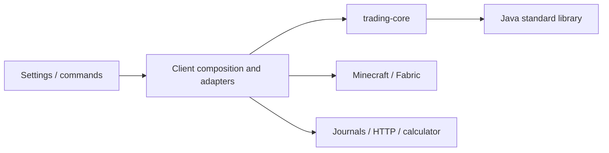

# Trading foundation

This module is the first implementation stage of the [architecture review](../docs/GOOFYADDONS-ARCHITECTURE-REVIEW.md). It gives the trading foundation a build-enforced dependency boundary. Minecraft, Fabric, the settings GUI, JSON persistence and the calculator remain outside it.

## Dependency direction



`trading-core` has no production dependencies. Compilation cannot resolve game/client classes; `verifyDependencyBoundary` also rejects added production classpath dependencies. The client consumes a project dependency and bundles the core as a nested JAR. It does not compile a second copy of these sources.

Package names were retained to avoid unrelated API churn. Physical source ownership is now here; adapters and full trading engines remain in `integrations/goofyaddons`.

## What belongs here

| Component | Responsibility |
| --- | --- |
| `Feature`, `TradingMode`, `TradingEngines` | Engine contract and composition policy, independent of concrete implementations |
| `MenuScheduler` | Exclusive menu ownership and yielding between transactions |
| `CapitalManager` | Shared reservations and budget calculations |
| `GameWorld`, `GameActions` | Observation/effect interfaces; implementations live outside the core |
| `MenuSnapshot`, `SlotView`, `ItemMetadata` | Captured evidence, with defensive copies of nested collections |
| `MenuObservationStability`, `MenuSettle` | Observation timing rules |
| `NavigationRetry`, `BedrockMenuRecovery` | Bounded recovery decisions based on supplied observations/actions |
| `Chat`, `MenuText` | Pure text normalization and menu-region helpers |
| `Clock` | Consumed action deadlines using a supplied time source |

Preserve null-versus-empty lore/enchantment semantics when adapting game data. Reading a snapshot must not mutate it or advance a transaction. The core must not locate a global client manager to obtain missing information: new behavior should receive it through an explicit argument or interface.

Navigation retries authorize reversible menu navigation only. They do not authorize repeating a purchase, claim or cancellation whose result is uncertain.

`FakeWorld` and `RecordingActions` are shared test fixtures, available to client tests through Gradle's test-fixtures dependency. They are excluded from the shipped mod.

## Checks

Use the repository Gradle wrapper with JDK 25 installed. Production bytecode and APIs target Java 21 through `--release 21`.

```sh
# Independent foundation checks: no Minecraft/Fabric or Node required.
./gradlew :trading-core:check

# Full client checks and artifact packaging.
./gradlew -p client test calculatorIntegrationTest build
```

The client test task depends on the foundation checks. CI runs the dependency-boundary check, not only unit tests. Existing core-related regression suites were moved here rather than duplicated or removed.

## Remaining foundation work

This extraction is not a claim that the full trading system is decoupled. `FeatureManager` remains the client composition point, both engines still contain large transaction/navigation state machines, and several live services still use global singletons through adapters, including the legacy `CapitalManager.INSTANCE`. Engine selection now delegates to `TradingEngines`, but session lifecycle coordination is still client-owned.

### General-trader dependency and storage separation (0.2.15)

The general trader now receives its world, actions, services and order repository explicitly. It no longer locates `FeatureManager`, config, profit tracking, diagnostics, chat hooks, Fabric or filesystem APIs itself. Constructing the engine does not read files or subscribe to global chat events.

- [GeneralTraderFactory](../integrations/goofyaddons/src/client/java/com/goofy/goofyaddons/features/generalflipper/GeneralTraderFactory.java) assembles live adapters, services and chat subscriptions. The manager reference is supplied by the composition point rather than looked up by the engine.
- [GeneralPosition](../integrations/goofyaddons/src/client/java/com/goofy/goofyaddons/features/generalflipper/GeneralPosition.java) holds saved trade state and batch validation; navigation steps remain in the executor. The engine validates the complete batch before adopting ownership, regardless of which storage adapter supplied it.
- [GeneralOrderRepository](../integrations/goofyaddons/src/client/java/com/goofy/goofyaddons/features/generalflipper/GeneralOrderRepository.java) defines storage operations. [JsonGeneralOrderRepository](../integrations/goofyaddons/src/client/java/com/goofy/goofyaddons/features/generalflipper/JsonGeneralOrderRepository.java) retains legacy field names, validation, path and replacement behavior.
- Settings, market quotes, action timing, accounting effects and safety-pause requests come through injected services. Financial effects are required implementations, rather than defaults that silently locate a live singleton.

The existing journal does not acquire a new schema in this pass. Writing submission intent remains a gate before the confirmation click. Failed writes retain ownership and block execution. Corrupt journals are preserved for inspection. Repository extraction does not make order/profit/history updates one atomic transaction; that remains a separate persistence stage.

The general engine still combines trading policy and menu execution and uses JSON quote/forecast types. It therefore remains outside the JDK-only core. Moving it into that module before removing these dependencies would undo the boundary.

Validated for 0.2.15: 70 foundation tests, 790 client tests and 7 calculator integration tests pass; the client JAR builds. New scenarios cover absent global config, independent engine budgets, invalid storage batches, legacy journal round trips, retry after a failed write and failure to persist submission intent before a buy-confirmation click. These are automated checks, not live server validation.

### Book-trader dependency and observation separation (0.2.16)

The book engine now receives world/actions, services and its ownership repository. `BookTraderFactory` owns live wiring and chat subscriptions. `BookPosition` is separate from the journal adapter; its legacy JSON fields are retained. The executor reads captured slot observations rather than raw Minecraft stacks and uses injected clocks for engine deadlines, monitoring and manual calculations. See the [refactor notes and checks](../docs/BOOK-ENGINE-REFACTOR.md).

Next structural stages:

1. Narrow the engines' broad service ports as shared transaction operations are extracted; keep live assembly in the composition layer.
2. Separate position/transaction state from navigation and persistence. Keep game effects explicit and preserve existing recovery semantics.
3. Define versioned repository and account/profile identity contracts before changing on-disk storage.
4. Move pure rules behind this boundary as each dependency is removed; retain regression scenarios for every extraction.

Do not migrate saved positions or change live trading policy as a side effect of moving a class. These passes establish source ownership, snapshot immutability and injected executor dependencies; they do not introduce a new order-file format, discard owned positions, or resolve the outstanding PC companion-startup diagnosis.
